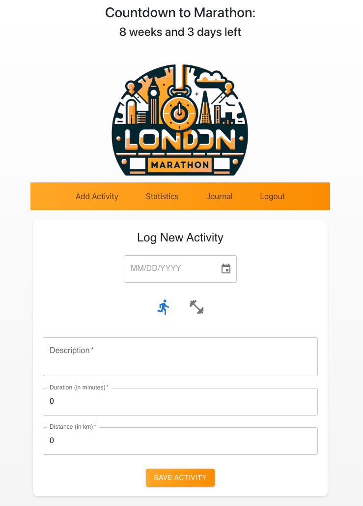
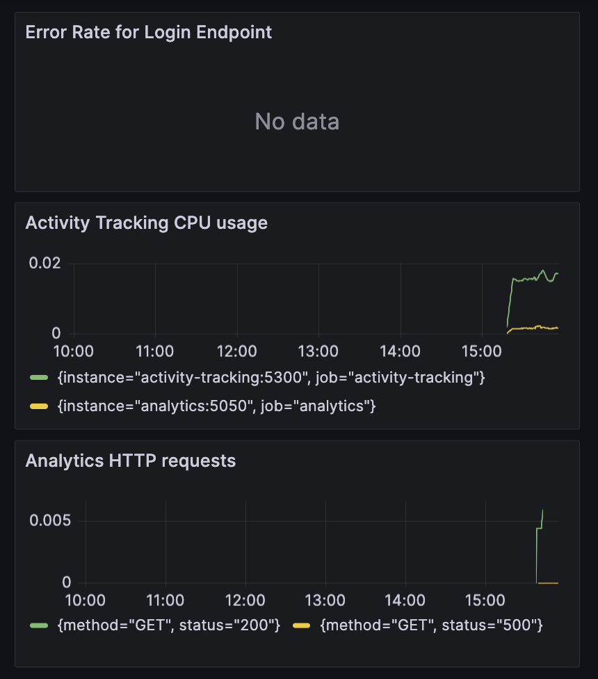

# Marathon Prep Tracker

A simple and interactive run workout tracking application built with multiple microservices and programming languages. This application allows users to track their exercises and monitor their progress over time.

The Activity Tracking functionality uses the MERN stack (MongoDB, Express.js, React, Node.js), the Analytics service uses Python/Flask and the Authentication Microservice using Java.



### Current Features

- User registration for personalized tracking
- Log various types of exercises with descriptions, duration, and date
- See weekly and overall statistics
- Interactive UI with Material-UI components
- Real-time data persistence with MongoDB

### Prerequisites

- Node.js
- MongoDB
- npm or yarn
- Python Flask
- Java 8
(all already installed in the devcontainer)


## Development in Github Codespaces

#### Starting a new Devcontainer

1. Click on "Code"
2. Switch to the "Codespaces" tab
3. Create new Codespace from main


4. Open Codespace in VS code for best experience:


Walktrough:

https://docs.github.com/en/codespaces/developing-in-a-codespace/using-github-codespaces-in-visual-studio-code


#### Check needed packages are installed:
```sh
sh .devcontainer/check-installation.sh 
```

expected output:

```
Checking installations...
node is /usr/local/bin/node
node is installed with version: v18.16.0
npm is /usr/local/bin/npm
npm is installed with version: 9.5.1
python3 is /usr/bin/python3
python3 is installed with version: Python 3.9.2
pip3 is /usr/bin/pip3
pip3 is installed with version: pip 20.3.4 from /usr/lib/python3/dist-packages/pip (python 3.9)
gradle is /usr/bin/gradle
gradle is installed with version: 
------------------------------------------------------------
Gradle 4.4.1
------------------------------------------------------------
......
Done checking installations.
```

if you're missing any version, please contact your course administrator. 


### Building entire project with Docker (+ starting containers up)
```sh
docker-compose up --build
```

### Start existing containers (no rebuild of images)
```sh
docker-compose up
```

#### Spinning up a single service
```sh
docker-compose up [servicename]
```

#### Shutting down a service
```sh
docker-compose down [servicename]
```


## Development without using Docker-Compose

#### Running Node.js Activity Tracker

```sh
cd activity
npm install
nodemon server
```

#### Running Flask application
```sh
cd analytics
flask run -h localhost -p 5050
```

#### Running Java application
```sh
cd auth
./gradlew clean build
./gradlew bootRun
```

#### Start the Frontend 

```sh
cd frontend
npm install
npm start
```

#### spin up MongoDB without docker-compose:
```
docker run --name mongodb -d -p 27017:27017 -v mongodbdata:/data/db mongo:latest
```

### Connect to MongoDB

```
mongosh -u root -p cfgmla23 --authenticationDatabase admin --host localhost --port 27017
```

show registered activities:
```
db.exercises.find()
```

show registered users:
```
db.users.find()
```


## Deployment
The application is containerized using Docker and can be deployed on any platform that supports Docker containers. For AWS deployment, a GitHub Actions pipeline is configured for CI/CD.

## Monitoring & Analytics:


#### 1. Start Services

```
docker-compose up -d
```

#### 2. Access Grafana

Open your web browser and go to http://localhost:3000.
Log in with the default username admin and the password you set in the docker-compose.yml file.

#### 3. Configure Prometheus as a Data Source

Once logged into Grafana, follow these steps to add Prometheus as a data source:
Click on the gear icon on the left panel to open the Configuration menu.
Select "Data Sources."
Click on the "Add data source" button.
Choose "Prometheus" as the data source type.
Set the URL to http://prometheus:9090.
Click "Save & Test" to ensure that Grafana can connect to your Prometheus instance.

#### 4. Create Dashboards and Panels

Click on Dashboards and then on Create new Dashboard".
Click "Add new visualisation."
From the panel editor, select the Prometheus data source from the drop-down menu.
Write your Prometheus query to fetch the metrics you want to visualise.
Customize your panel with the visualisation options provided by Grafana.
Save the panel and dashboard when you're done.

Examples:

auth:
```
jvm_memory_used_bytes{area="heap"}
```

activity:
```
rate(process_cpu_seconds_total[5m])
```

Analytics:
```
sum(rate(flask_http_request_total[5m])) by (method, status)
```

#### 5. Explore Metrics

Use the Explore feature in Grafana to experiment with queries against your Prometheus data source and see the results in real time.

 

#### 6. Set Up Alerts (Optional)

Grafana can also be used to set up alerts based on specific conditions within your dashboard panels. To set up alerts, edit a panel and go to the "Alert" tab to define alert rules.
