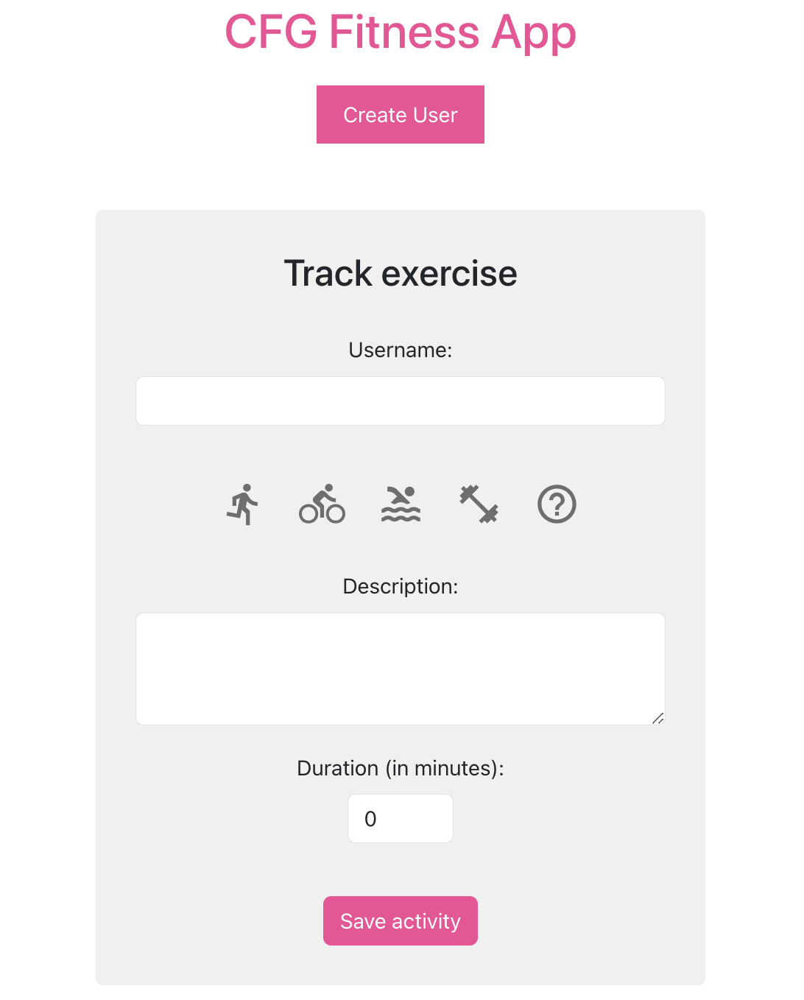

# MERN Fitness Tracker

A simple and interactive fitness tracking application built with the MERN stack (MongoDB, Express.js, React, Node.js). This application allows users to track their exercises and monitor their progress over time.

  

## Features

- User registration for personalized tracking
- Log various types of exercises with descriptions, duration, and date
- Interactive UI with Material-UI components
- Real-time data persistence with MongoDB

## Prerequisites

- Node.js
- MongoDB
- npm or yarn

## Local Development

### Clone the repository

```sh
git clone git@github.com:nadinedelia/mern-fitnessapp.git
cd mern-fitnesstracker
```

### Install dependencies

```sh
cd activity-tracking
npm install
cd ../frontend
npm install
```

### Start the development servers

```sh
cd activity-tracking
nodemon server
cd ../frontend
npm start
```

### Deployment
The application is containerized using Docker and can be deployed on any platform that supports Docker containers. For AWS deployment, a GitHub Actions pipeline is configured for CI/CD.

### Building with Docker

```
docker-compose up
```

### Connect to MongoDB

```
mongosh -u root -p cfgmla23 --authenticationDatabase admin --host localhost --port 27017
```

show registered activities:
```
db.exercises.find()
```

show registered users:
```
db.users.find()
```